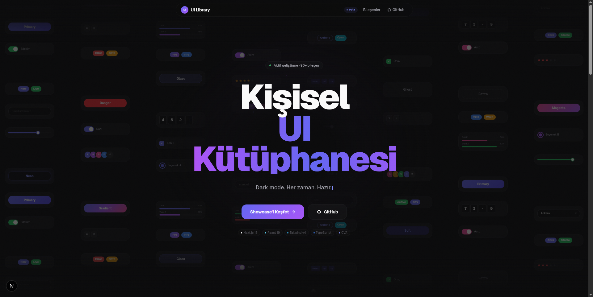

<div align="center">

# UI Library

**A personal, production-ready UI component library built with Next.js, React 19, and Tailwind CSS v4.**

[](https://nextjs.org)
[](https://react.dev)
[](https://www.typescriptlang.org)
[](https://tailwindcss.com)
[](./LICENSE)

</div>

---



> *Dark mode. Every time. Ready.*

---

## What is this?

UI Library is a curated collection of **100+ handcrafted UI components** and **19 full-page templates** — built for speed, consistency, and real-world use. Every component is live-demoed in an interactive showcase with code preview, viewport toggling, and copy support. No external UI framework dependencies. Just Next.js, Tailwind CSS v4, and clean TypeScript.

---

## Tech Stack

| Technology | Version | Purpose |
|---|---|---|
| [Next.js](https://nextjs.org) | 16.2 | App framework (App Router) |
| [React](https://react.dev) | 19 | UI rendering |
| [TypeScript](https://www.typescriptlang.org) | ^5 | Type safety |
| [Tailwind CSS](https://tailwindcss.com) | v4 | Utility-first styling |
| [Class Variance Authority](https://cva.style) | ^0.7 | Component variant system |
| [next-themes](https://github.com/pacocoursey/next-themes) | ^0.4 | Dark/light theme switching |
| [tailwind-merge](https://github.com/dcastil/tailwind-merge) | ^3.6 | Safe class merging |

---

## Components

### Primitives
`Button` · `Input` · `Textarea` · `Select` · `Checkbox` · `Radio` · `Toggle` · `Badge` · `Avatar` · `Spinner` · `Tooltip` · `Kbd`

### Layout
`Navbar` · `Sidebar` · `Footer` · `Breadcrumb` · `Container` · `BottomNav`

### Data Display
`Card` · `Table` · `DataTable` · `Pagination` · `Timeline` · `EmptyState` · `StatCard` · `LogoWall` · `Testimonial` · `List` · `TreeView`

### Forms & Inputs
`ColorPicker` · `DatePicker` · `FileUpload` · `OTP` · `TagInput` · `RatingInput` · `PhoneInput` · `Combobox` · `MultiStepForm` · `Stepper` · `Slider`

### Feedback & Overlays
`Modal` · `Drawer` · `Toast` · `Alert` · `Banner` · `NotificationCenter` · `CookieConsent` · `Countdown`

### Charts & Visualization
`AreaChart` · `BarChart` · `LineChart` · `RadarChart` · `DonutChart` · `GaugeChart` · `ProgressRing` · `HeatMap` · `MiniBarChart` · `Sparkline`

### Animation & Motion
`Marquee` · `Typewriter` · `ShimmerText` · `Reveal` · `NumberFlow` · `AnimatedCounter` · `MagneticButton` · `ConfettiButton` · `BgAnimation` · `BackgroundPattern` · `ScrollProgress`

### Navigation & UX
`Accordion` · `Tabs` · `Popover` · `ContextMenu` · `CommandPalette` · `Tour` · `BackToTop`

### Developer Tools
`CodeBlock` · `DiffViewer` · `LogViewer` · `ReadingTime`

### Misc
`ThemeToggle` · `ThemeSwitcher` · `ShareButton` · `PrintButton` · `KanbanBoard` · `Skeleton` · `Progress` · `PricingTable` · `ComparisonTable` · `FaqList` · `FeatureGrid`

---

## Charts

10 fully custom SVG/Canvas charts — zero external chart libraries:

| Component | Type | Features |
|---|---|---|
| `BarChart` | SVG | Grouped datasets · horizontal mode · negative values · hover tooltip |
| `LineChart` | SVG | Smooth bezier curves · null gap support · filled area · multi-dataset |
| `AreaChart` | SVG | Stacked areas · gradient fill · smooth interpolation |
| `RadarChart` | SVG | Multi-dataset · polar grid · hover highlight |
| `DonutChart` | SVG | Segments · center label · legend · animation |
| `GaugeChart` | SVG | Arc gauge · color zones · animated needle |
| `ProgressRing` | SVG | Mount animation · `prefers-reduced-motion` · custom center slot |
| `HeatMap` | SVG | GitHub-style · seeded random · hover tooltip · color intensity |
| `MiniBarChart` | SVG | Inline sparkbar · compact |
| `Sparkline` | SVG | Trend line · minimal footprint |

---

## Background Animations

12 animation types — pure CSS or Canvas, no external dependencies:

| Type | Render | Best For |
|---|---|---|
| `aurora` | CSS | SaaS hero · AI product · Education |
| `particles` | CSS | Startup · pitch decks |
| `grid-pulse` | CSS | Developer tools · Fintech |
| `wave` | CSS | Music · audio platforms |
| `gradient-shift` | CSS | E-commerce · lifestyle brands |
| `bubbles` | CSS | Health · wellness apps |
| `meteor` | CSS | Gaming · speed-themed products |
| `noise-drift` | CSS | Creative · Real estate · NFT |
| `beam` | CSS | Cyber security · sci-fi |
| `matrix` | Canvas | Web3 · crypto · terminal |
| `circuit` | Canvas | IoT · hardware · global infra |
| `confetti-rain` | CSS | Success screens · onboarding |

15 real-world scenario demos included (SaaS, Fintech, Gaming, Music, E-commerce, API Docs, Success, Health, AI, Startup, CDN, Fintech, Education, Real Estate, Web3).

---

## Templates

19 full-page layouts ready to drop in:

| Category | Templates |
|---|---|
| **Landing** | Generic · SaaS · App · Portfolio · E-commerce · Event · Blog · Startup · Agency |
| **Dashboard** | Dashboard · Analytics · Inbox · Settings · Profile · Kanban |
| **Marketing** | Pricing · Blog |
| **Auth** | Login · Register · Forgot Password |
| **Utility** | Error Page |

---

## Design System

The library ships with a full set of CSS custom properties for theming. All tokens support **dark mode out of the box**.

```css
/* Brand */
--primary        /* Indigo #6366f1 — main accent */
--primary-hover
--primary-subtle

/* Semantic */
--success · --warning · --danger · --info

/* Surfaces */
--background · --background-subtle · --background-muted
--surface · --surface-raised · --surface-overlay

/* Text */
--foreground · --foreground-muted · --foreground-subtle

/* Border */
--border · --border-strong
```

Button variants: `primary` · `secondary` · `outline` · `ghost` · `danger` · `link`

Style presets: `brutal` · `neon` · `glass` · `gradient` · `soft` · `retro`

---

## Getting Started

```bash
# Clone the repository
git clone https://github.com/emirhandurmus61/ui-library.git
cd ui-library

# Install dependencies
npm install

# Start the development server
npm run dev
```

Open [http://localhost:3000](http://localhost:3000) to see the landing page.  
Browse components at [http://localhost:3000/showcase](http://localhost:3000/showcase).

---

## Project Structure

```
ui-library/
├── app/
│   ├── page.tsx              # Interactive landing page
│   ├── globals.css           # Design tokens & global styles
│   ├── layout.tsx            # Root layout with theme provider
│   └── showcase/             # 100+ live component demos
│       └── templates/        # 19 full-page template demos
├── components/
│   └── ui/                   # All UI components (source of truth)
│       └── templates/        # Page-level template components
├── lib/
│   └── utils.ts              # cn() utility for class merging
└── public/                   # Static assets
```

---

## Usage

Import any component directly from its path:

```tsx
import { Button } from "@/components/ui/button";
import { Card } from "@/components/ui/card";
import { Modal } from "@/components/ui/modal";

export default function Page() {
  return (
    <Card>
      <Button variant="primary">Open Modal</Button>
    </Card>
  );
}
```

All components are written in TypeScript, use CVA for variants, and follow accessible markup conventions.

---

## Showcase

Every component has a dedicated showcase page with:
- Live interactive examples
- Multiple variants and states (disabled, loading, error, etc.)
- Responsive viewport previews (Desktop · Tablet · Mobile)
- Copy-ready code snippets (JSX only or with imports)

Navigate to `/showcase` to explore all components in action.

---

<div align="center">

Built by [Emirhan Durmuş](https://github.com/emirhandurmus61)

</div>
